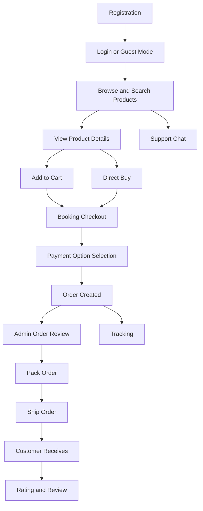
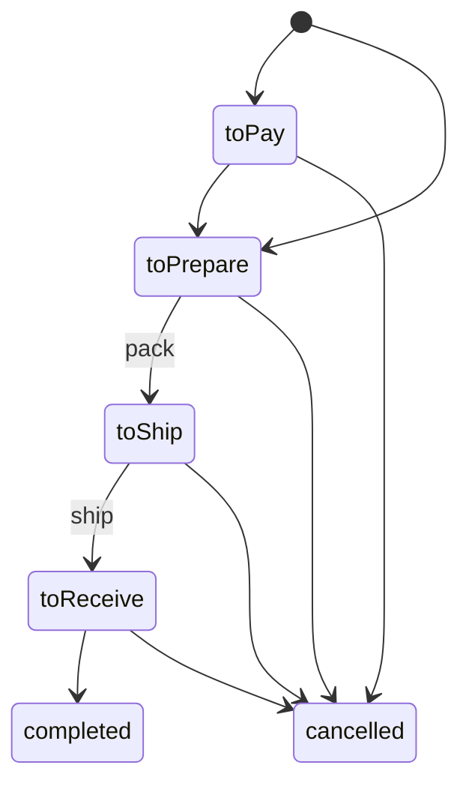
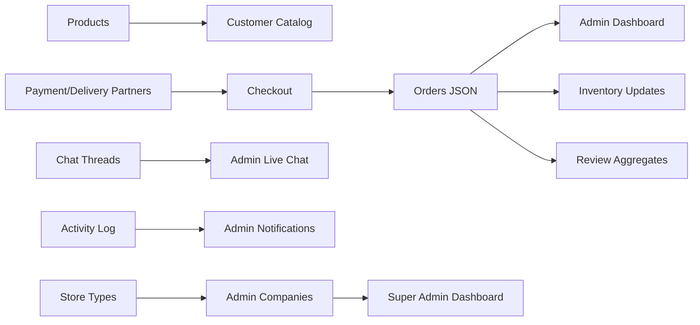

# Business Process

## Process Overview

Switch connects customer shopping behavior with admin operations. Customers browse, purchase, track, review, and chat. Admins manage the catalog, inventory, partners, orders, employees, reports, and live support. Super admins govern companies, global categories, business/store types, and product approvals.

## Customer Journey

1. Customer opens the Flutter app.
2. The app loads guest/auth session, local stores, remote orders, products, sellers, and chat state.
3. Customer browses home/shop, searches by text or image, or opens seller pages.
4. Customer views product details, variants, stock, ratings, seller identity, media, and reviews.
5. Customer adds items to cart or selects direct buy.
6. Customer completes booking checkout with delivery details, partner selections, and payment option.
7. Order is synced to the backend.
8. Customer tracks order stage and can contact support.
9. Customer reviews product after purchase.

## Registration

### Customer Registration

1. Customer opens `RegisterPage`.
2. App validates basic account details.
3. App posts account data to `/api/accounts`.
4. Backend normalizes the record, checks duplicates, stores it in `accounts.json`, and returns the account.
5. App can log the user in and load per-account stores.

### Admin Registration

1. Admin opens admin signup or super admin creates an admin company.
2. Admin data is posted to `/api/admin-register` or `/api/super-admin/admins`.
3. Backend normalizes admin account and checks duplicate email/mobile.
4. Account is stored in `accounts.json`.
5. Admin uses `/api/admin-login` to access the dashboard.

### Employee Registration

1. Admin creates employee in the web console.
2. Employee fields, access permissions, optional document, and profile data are submitted to `/api/accounts`.
3. Employee can log in through `/api/employee-login`.
4. Employee page access is gated in the browser by `employee_access_guard.js`.

## Shopping Flow

1. Customer opens home/shop.
2. App fetches approved products from `/api/products?approvalStatus=approved`.
3. App fetches categories from `/api/categories`.
4. Customer filters by category, searches text, or uses visual search.
5. Product cards show price, stock, ratings, company identity, and badges.
6. Customer opens product details to view media, variants, reviews, seller, chat, cart, and buy actions.

## Booking Flow

1. Customer enters checkout from cart or direct buy.
2. Checkout builds `BookingLineItem` records from product snapshots.
3. Customer enters or selects saved client details.
4. App loads delivery/payment partners.
5. Customer chooses payment collection option.
6. Checkout builds order entries and syncs them through `/api/orders`.
7. Order tab navigation moves the customer to the relevant order stage.

## Payment Flow

Current implementation records payment selection, but does not call an external payment gateway.

1. Admin creates payment partners in the web console.
2. Product records may restrict available payment partner IDs.
3. Checkout displays eligible payment partners.
4. Customer selects payment option and partner.
5. Order stores payment partner name/image, payment option label, amount to pay, remaining balance, and totals.
6. Admin reports and dashboards derive payment totals from order records.

## Order Flow

1. Orders are stored in `orders.json`.
2. Admin and employee dashboards fetch scoped orders through `/api/orders`.
3. Packing action calls `/api/orders/{createdAtEpochMs}/pack`.
4. Ship action calls `/api/orders/{createdAtEpochMs}/ship`.
5. Cancel action calls `/api/orders/{createdAtEpochMs}/cancel`.
6. Cancel requests are accepted/rejected through `/api/orders/{createdAtEpochMs}/cancel-request/{decision}`.

## Tracking Flow

1. Customer order tabs and tracking pages read order stages.
2. Admin tracking page reads the same order records.
3. Packing and shipping actions update `stage`.
4. Customer app refreshes/syncs orders and updates visible status.

No direct courier tracking API was found; tracking is currently internal status tracking.

## Notification Flow

1. Backend creates activity entries for product and employee/account changes.
2. Entries are stored in `activity_log.json`, capped at 50 records.
3. Admin navigation/settings scripts poll `/api/activity` and other APIs.
4. Notification menus filter visible activities by admin scope, viewer, and permissions.
5. Notification sound assets are present for admin web and Flutter app.

## Reporting Flow

1. Admin dashboards and insight pages fetch products, orders, accounts, partners, followers, and chat data.
2. Browser scripts calculate summary metrics and charts.
3. Product insight reads products and orders to calculate rating/review/sales metrics.
4. Super admin dashboard combines accounts, products, orders, categories, store types, and followers.

## Money Flow

1. Product price and discounts are stored in product records.
2. Checkout snapshots unit prices, grand total, amount to pay, remaining balance, shipping fee, payment option, and partner labels into order records.
3. Payment partner is informational/configurable. No actual payment capture or settlement API exists in the code.
4. Store Type records include `commissionRate` and `serviceFee` for dashboard visibility.
5. Revenue, sales, and analytics are inferred from order totals and stages.

## Information Movement

## Assumptions

- "Booking" means checkout/order placement in `place_order.dart`.
- "Payment flow" is record keeping and partner selection, not live gateway processing.
- "Tracking flow" is internal order-stage tracking, not external courier tracking.
- "Money flow" is inferred from order totals and Store Type commission/service fee fields.

