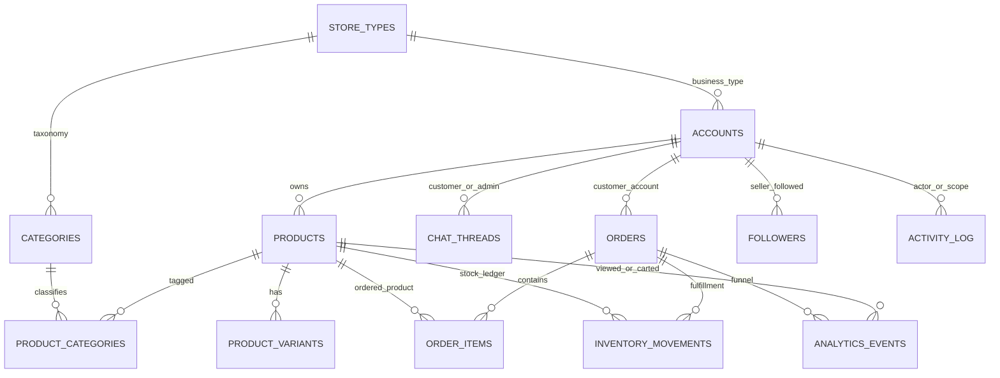

# Database Documentation

## Storage Overview

Switch is a **hybrid** store. PostgreSQL is the source of truth for accounts, store types, categories, products, and orders when `DATABASE_URL` is set and migrations have been applied. Other collections (chat, partners, activity, followers, vouchers, flash deals) still use JSON files under `backend/data/`.

| Domain | Source of truth when `DATABASE_URL` is set | Fallback / backup |
| --- | --- | --- |
| Accounts / auth / trending searches | PostgreSQL (`001`–`012`) | JSON only if Postgres is unset or unreachable |
| Store types, categories, products, orders, inventory movements | PostgreSQL (`013`–`019`) | JSON dual-write backup (`CATALOG_JSON_BACKUP`, default on) |
| Marketplace analytics events + funnel/GMV | PostgreSQL (`021`) | none (append-only events; no JSON fallback) |
| Chat, partners, activity, followers, and similar | JSON files | n/a (Phase B will move chat) |

`npm run db:migrate` applies numbered SQL files in `backend/db/migrations/`. Import existing catalog/order JSON with `npm run db:migrate-catalog`.

Runtime JSON files are stored under `backend/data` and are ignored by Git:

```text
backend/data/accounts.json
backend/data/products.json
backend/data/orders.json
backend/data/categories.json
backend/data/store_types.json
backend/data/chat_threads.json
backend/data/delivery_partners.json
backend/data/payment_partners.json
backend/data/followers.json
backend/data/activity_log.json
```

### Catalog / orders cutover strategy (Phase A)

- **Reads:** If the catalog schema is present, `readProducts` / `readOrders` / `readStoreTypes` load from Postgres. Otherwise they read JSON.
- **Writes:** Postgres is the source of truth. A failed Postgres write fails the request. After a successful Postgres write, the matching JSON file is updated as a best-effort backup unless `CATALOG_JSON_BACKUP=0`.
- **Stable IDs:** `products.id`, `product_variants.id`, `order_items.id`, and `orders.id` (`order_group_id`) are application-assigned TEXT keys. JSON string IDs are kept on import and dual-write and are never rewritten when present. Order groups without `orderGroupId` get a deterministic `og_*` from `adminId + accountId + createdAtEpochMs` during JSON import so re-running migrate does not mint a new key. `order_group_id` stays stable across dual-write cutover.
- **New order groups** that have no prior id receive a server-generated `orderGroupId` (`og_*`). `createdAtEpochMs` is still stored so existing pack/ship/cancel/waybill clients keep working. Those endpoints now accept either `orderGroupId` or `createdAtEpochMs`.
- **Lifecycle timestamps (Step 5 funnel):** orders/order_items expose `created_at`, `paid_at` (left `toPay` → `toPrepare` / `awaitingWaybill`), `packed_at` (`toShip`), `shipped_at` (`toReceive`), `received_at` (`toReview` / `customerReceivedAtEpochMs`), `cancelled_at`, and `return_requested_at`. Products keep `submitted_at`, `approved_at`, `rejected_at`, plus `listed_at`. Historical JSON that lacks per-stage times may infer `paid_at`/`packed_at` from stage using `created_at`; later explicit stamps are first-write-wins.
- **Payment + tracking (Step 6 prep):** `orders` / `order_items` have `payment_intent_id`, `payment_checkout_session_id`, `payment_idempotency_key`, `payment_client_key`, `payment_reference`, `payment_provider`, `payment_status`, and `tracking_number`. PayMongo adapters are not wired; unique indexes on intent id and idempotency key are ready for later checkout. Ship may persist `trackingNumber` without requiring it.
- **Tenant scoping:** list/page product and order reads filter by `admin_id` (seller) or `account_id` (buyer). Public product catalog is approved+active only — never another seller's pending listings. Dual-write upserts are session-gated; Postgres deletes are tenant-scoped when `adminId`/`accountId` is passed so one seller cannot wipe another.
- **Inventory:** `inventory_movements` is the durable ledger. Product `stockHistory` and order `inventoryMovements` remain in JSONB `extra_data` for API compatibility.
- **Chat is not migrated in this phase.**

List endpoints `GET /api/products` and `GET /api/orders` accept `limit` and `offset` (optional `cursor` is reserved). When those query params are present, the response includes `pagination: { limit, offset, total, hasMore }`. Omitting them keeps the previous full-list response.

## ER Diagram



## Common Relationship Fields

| Field | Used In | Meaning |
| --- | --- | --- |
| `adminId` | Accounts, products, orders, categories, partners, chat, activity | Tenant/store/company/workspace owner. |
| `accountId` | Orders, followers, chat/customer flows | Customer account identifier. |
| `productId` | Orders, chat threads, reviews, product actions | Product identifier. |
| `orderGroupId` | Orders / order items | Server-generated checkout group id (`og_*`). Preferred group key. |
| `createdAtEpochMs` | Orders | Legacy group timestamp; still accepted by pack/ship/cancel. |
| `threadId` | Chat threads | Chat conversation identifier. |
| `deliveryPartnerIds`, `paymentPartnerIds` | Products | Partner IDs allowed for product checkout. |
| `storeType`, `storeTypeName`, `businessType` | Accounts | Store/business type classification. |

## Constraints and Indexes

PostgreSQL (when configured):

- Unique: `accounts.email`, seller `admin_id`, employee `(admin_id, employee_id)`, `store_types.name_normalized`, category name per store type or admin workspace, product `(admin_id, barcode)` when barcode is non-empty, `orders.order_group_id`.
- Indexes include `admin_id`, `account_id`, `product_id`, `approval_status`, `created_at`, order/product lifecycle times (`paid_at`, `packed_at`, `shipped_at`, `submitted_at`, `approved_at`), and analytics `(event_name, created_at)`, `order_id`, `product_id`, `admin_id`.
- Catalog writes run in a SQL transaction per sync. JSON backups are not transactional.
- `adminId` remains the primary multi-tenant scope. Product/order rows do not FK to `accounts` so JSON imports can run before every seller/buyer exists in Postgres.

JSON fallback (when `DATABASE_URL` is unset):

- Uniqueness is enforced in code (admin email, phone, employee ID, account email, barcode within an admin scope).
- Whole-file rewrites are not transactional.

## PostgreSQL tables (Phase A catalog / orders)

Applied by `013_store_types.sql` through `019_order_payment_tracking.sql`, plus `021_analytics_events.sql`.

### `store_types`

Global Super Admin business types. API still returns `name`, `categories`, and `categoryDetails`; rows now have stable `id` values (`st_*`).

### `categories`

Taxonomy rows linked to a `store_type_id`, plus workspace rows keyed by `admin_id` for product tags. Products join through `product_categories` rather than name-only.

### `products` / `product_variants` / `product_categories`

Queryable columns cover CRUD and catalog filters (`admin_id`, `approval_status`, prices, stock, barcode, primary `category`). Approval lifecycle columns: `submitted_at`, `approved_at`, `rejected_at`, `approval_updated_at`, `listed_at`. Remaining legacy fields (media galleries, visual-search fingerprints, YOLO, `stockHistory`, reviews) live in `extra_data` JSONB for a lossless round-trip with `products.json`. `id` is the JSON product id.

### `orders` / `order_items`

`orders` is the checkout **group** (`id` = `order_group_id`). `order_items` are the flat line items the API still returns as `orders: [...]`. Each reconstructed line includes `orderGroupId` and `createdAtEpochMs`. Line `id` is the JSON order entry id.

Lifecycle columns on both tables (migration `018`), matching codebase stages `toPay` → `toPrepare`/`awaitingWaybill` → `toShip` → `toReceive` → `toReview` (plus `returnRequest`, `cancelled`):

| Column | Stage / source |
| --- | --- |
| `created_at` | Order placed (`toPay`) |
| `paid_at` | Left unpaid (`toPrepare` or `awaitingWaybill`) |
| `packed_at` | Pack endpoint (`toShip`); also `inventoryDeductedAtEpochMs` |
| `shipped_at` | Ship endpoint (`toReceive`) |
| `received_at` | Customer receipt (`toReview` / `customerReceivedAtEpochMs`) |
| `cancelled_at` | `cancelled` |
| `return_requested_at` | `returnRequest` |
| `waybill_printed_at` | `waybillPrintedAtEpochMs` |

Step 6 payment / tracking columns (migration `019`) live on the **group** (`orders`) and are copied onto line items for the flat API:

| Column | Purpose |
| --- | --- |
| `payment_intent_id` | PayMongo Payment Intent id (`pi_…`) |
| `payment_checkout_session_id` | Checkout Session id (`cs_…`) |
| `payment_idempotency_key` | First-write-wins idempotency key |
| `payment_client_key` | Client key for a future SDK attach |
| `payment_reference` | Merchant reference |
| `payment_provider` / `payment_status` | e.g. `paymongo` |
| `tracking_number` | Optional ship/pack tracking no. |

### `analytics_events`

Append-only funnel events (migration `021`). See [ANALYTICS.md](ANALYTICS.md) for the taxonomy (`product_view`, `add_to_cart`, `begin_checkout`, `place_order`, `payment_success`, `payment_fail`, `pack`, `ship`, `cancel`).

| Column | Notes |
| --- | --- |
| `id` | Application key (`ae_*`). |
| `admin_id` | Seller tenant. Forced from the signed session for seller/employee ingest. |
| `user_id` / `session_id` | Nullable buyer account and client session. |
| `event_name` | Allowlisted taxonomy value. |
| `product_id` | Nullable; indexed, not FK (views survive listing deletion). |
| `order_id` | Nullable FK to `orders(id)` `ON DELETE SET NULL`. Unknown ids are stored as NULL. |
| `properties` | JSONB extras (`quantity`, `variantId`, `source`, …). |
| `created_at` | Ingest time. |

`GET /api/analytics/funnel` and `GET /api/analytics/summary` read this table plus `orders` / `order_items` (GMV is the sum of paid line totals). There is no JSON file fallback.

### `inventory_movements`

Ledger of deduct / restore / restock / adjust events from order fulfillment and product `stockHistory`. Not a substitute for on-hand `products.stock`; it is the audit trail.

## JSON document shapes (API + fallback)

The JSON collections below describe the document shape the API still speaks. When Postgres is enabled, modules under `backend/services/postgres*Store.js` map these documents to tables and back.

### `accounts.json`

Stores admin companies, employees, and customer app users in one collection.

| Field | Type | Notes |
| --- | --- | --- |
| `id` | string | Primary identifier. |
| `adminId` | string | Workspace/company scope. For admin accounts, often equals the admin/company ID. |
| `accountCode` | string | Account or employee code. |
| `role` | string | Examples include admin, employee, and user. |
| `source` | string | Source such as app or web. |
| `storeName`, `companyName`, `businessName` | string | Company/store display names. |
| `storeType`, `storeTypeName`, `businessType` | string | Business type classification. |
| `firstName`, `middleName`, `lastName`, `suffix` | string | Person name fields. |
| `email` | string | Login/contact email. |
| `countryCode`, `mobileNumber` | string | Contact number fields. |
| `password` | string | bcrypt hash only. Plaintext is rejected on write. |
| `profileImageUrl` | string | Uploaded profile/logo image. |
| `accessPermissions` | array | Employee/admin module permissions. |
| `accessPermissionGrantedAt` | object | Permission grant timestamps keyed by permission ID. |
| `accessPermissionsConfigured` | boolean | Whether permissions were explicitly configured. |
| `createdAt`, `updatedAt`, `passwordUpdatedAt` | string | ISO timestamps. |
| `isOnline`, `onlineStatus`, `presenceStatus`, `presenceUpdatedAt` | boolean/string | Admin/employee presence. |
| `lastLoginAt`, `lastLogoutAt` | string | Login tracking. |
| `employeeId`, `position`, `timeIn`, `timeOut`, `workHours` | string/number | Employee metadata. |
| `address` | string | User/employee address. |
| `eDocument` | object | Uploaded employee document metadata. |
| `faceVerified`, `verifiedAt` | boolean/string/null | Face verification metadata. |

Nested `eDocument` fields: `type`, `label`, `fileName`, `fileExtension`, `url`, `uploadedAt`.

Primary key: `id`.

Foreign keys/soft references: `adminId` references an admin account/workspace. Store type fields reference `store_types.json` by name.

### `products.json`

Stores catalog products submitted by admins. Postgres table `products` plus `product_variants` / `product_categories` when `DATABASE_URL` is set.

| Field | Type | Notes |
| --- | --- | --- |
| `id` | string | Primary identifier. Kept as-is in Postgres (`products.id`). |
| `adminId` | string | Owner workspace. |
| `approvalStatus` | string | Pending/approved state for super admin review. |
| `submittedAt`, `approvedAt`, `approvedBy`, `approvalUpdatedAt`, `rejectedAt`, `listedAt` | string | Approval / listing lifecycle; first-class Postgres columns. |
| `name`, `description` | string | Product content. |
| `isActive` | boolean | Visibility/availability toggle. |
| `originalPrice`, `salesPrice` | number | Pricing. |
| `category`, `categories` | string/array | Primary and multi-category values. |
| `imageUrl`, `mainImageUrl`, `imageUrls`, `cardImageUrl` | string/array | Product image references. |
| `videoUrl`, `videoUrls`, `videoThumbnailUrl`, `videoThumbnailUrls` | string/array | Product video references. |
| `model3dUrl`, `model3dScanImageUrls` | string/array | 3D model and source scan assets. |
| `visualSearchImageUrl`, `visualSearchImageUrls`, `visualSearchImageAngles` | string/array/object | Visual search source images. |
| `visualSearchFingerprint`, `visualSearchFingerprints` | object/array | Generated visual-search fingerprints. |
| `stock`, `sold` | number | Inventory and sales counters. |
| `rating`, `ratingCount`, `ratingPoints`, `reviewCount`, `commentCount` | number | Aggregated review/rating values. |
| `variants` | array | Product variant records. |
| `stockHistory` | array | Inventory changes. |
| `barcode` | string | Barcode, unique within admin scope in product save code. |
| `deliveryPartnerIds`, `paymentPartnerIds` | array | Allowed partner references. |
| `reviewComments`, `productReviewComments`, `reviews` | array | Review/comment data or legacy fields. |
| `ratingBreakdown`, `productRatingBreakdown` | object | Counts for ratings 1 through 5. |
| `createdAt`, `updatedAt` | string | ISO timestamps. |

Product variant fields from the Flutter model: `id`, `name`, `quantity`, `imageUrl`, `originalPrice`, `salesPrice`, `stock`, `addOns`.

Stock history fields: `id`, `stock`, `addedQuantity`, `deductedQuantity`, `expiryDate`, `modifiedAt`, `reason`, `label`.

Primary key: `id`.

Foreign keys/soft references: `adminId` -> accounts, partner IDs -> partner collections, `categoryIds` -> `categories.id` (names still returned for compatibility).

### `orders.json`

Stores customer order line items. Multiple lines share `orderGroupId` (server-generated) and `createdAtEpochMs` (legacy). Postgres uses `orders` (group) + `order_items` (lines).

| Field | Type | Notes |
| --- | --- | --- |
| `id` | string | Order line identifier. Stable Postgres `order_items.id`. |
| `orderGroupId` | string | Checkout group id (`og_*`). Stable Postgres `orders.id`. |
| `adminId` | string | Store/workspace owner. |
| `accountId` | string | Customer account. |
| `productId`, `productName`, `productImageUrl` | string | Purchased product snapshot. |
| `variantId`, `variantName`, `addOns` | string/array | Variant/add-on snapshot. |
| `quantity`, `unitPrice` | number | Line item quantity/pricing. |
| `stage` | string | `toPay`, `awaitingWaybill`, `toPrepare`, `toShip`, `toReceive`, `toReview`, `returnRequest`, or `cancelled`. |
| `createdAtEpochMs`, `createdAt` | number/string | Placed-at timestamp. |
| `paidAt`, `packedAt`, `shippedAt`, `receivedAt`, `cancelledAt`, `returnRequestedAt`, `waybillPrintedAt` | string | Funnel transition times (ISO). Epoch-ms twins also stored. |
| `paymentIntentId`, `paymentCheckoutSessionId`, `paymentIdempotencyKey`, `paymentClientKey`, `paymentReference`, `paymentProvider`, `paymentStatus` | string | Step 6 PayMongo prep columns; adapters not wired. |
| `trackingNumber` | string | Optional shipment tracking; also accepted as `trackingNo`. |
| `grandTotalAmount`, `amountToPayAmount`, `remainingBalanceAmount`, `shippingFeeAmount` | number | Payment amount breakdown. |
| `paymentOptionLabel`, `paymentPartnerName`, `paymentPartnerImageUrl` | string | Payment selection snapshot. |
| `deliveryPartnerName`, `deliveryPartnerImageUrl` | string | Delivery selection snapshot. |
| `clientName`, `clientContactNumber`, `clientAddress` | string | Delivery/contact details. |
| `cancelRequestStatus`, `cancelRequestReason`, `cancelRequestSubmittedAtEpochMs`, `cancelRequestResolvedAtEpochMs` | string/number | Cancellation workflow. |
| `inventoryDeducted`, `inventoryDeductedAtEpochMs`, `inventoryRestoredAtEpochMs` | boolean/number | Inventory movement status. |
| `inventoryMovements` | array | Deduct/restore line details. |
| `productRating`, `productReviewRating`, `productRatedAtEpochMs` | number | Review rating details. |
| `productReviewComment`, `productReviewMedia` | string/array | Review content and uploaded media. |
| `productReviewReply*` | string/number | Seller reply snapshot. |
| `status`, `amount`, `total`, `price`, `courier`, `deliveryProvider`, `payment`, `paymentMethod` | string/number | Legacy or compatibility fields. |

Inventory movement fields: `orderEntryId`, `productId`, `productName`, `variantId`, `variantName`, `quantity`, `role`, `parentProductId`, `parentVariantId`, `adjustedVariant`.

Review media fields: `id`, `type`, `url`, `mediaUrl`, `imageUrl`, `videoUrl`, `fileName`, `contentType`, `sizeBytes`, `uploadedAtEpochMs`, `uploadedAt`.

Primary key: `id`.

Foreign keys/soft references: `accountId` -> accounts, `productId` -> products, `adminId` -> admin workspace.

### `categories.json`

Stores category names.

| Field | Type | Notes |
| --- | --- | --- |
| `name` | string | Category display name. |
| `adminId` | string | Workspace scope. Global categories use the default admin scope. |

Primary key: no explicit ID; `name` plus `adminId` is the logical key.

Foreign keys/soft references: Products reference categories by name.

### `store_types.json`

Stores global Store Type/Business Type definitions managed by super admin. Postgres table `store_types`; nested categories are rows in `categories`.

| Field | Type | Notes |
| --- | --- | --- |
| `name` | string | Logical primary key and display name. |
| `categories` | array | Categories associated with this business type. |
| `status` | string | Active/inactive style status. Public `/api/store-types` only returns active store types. |
| `commissionRate` | number | Commission percentage or rate value used for dashboard visibility. |
| `serviceFee` | number | Service fee value used for dashboard visibility. |

Primary key: `name`.

Foreign keys/soft references: Accounts reference store types by `storeType`, `storeTypeName`, or `businessType`.

### `chat_threads.json`

Stores customer support conversations.

| Field | Type | Notes |
| --- | --- | --- |
| `threadId` | string | Primary identifier. |
| `adminId` | string | Store/workspace owner. |
| `customerId`, `userId` | string | Customer account identifier. |
| `customerLabel` | string | Customer display label. |
| `productId`, `productName`, `productCategory`, `productDescription`, `productImageUrl` | string | Product context. |
| `productOriginalPrice`, `productSalesPrice`, `productStock`, `productSold`, `productRating` | number | Product snapshot. |
| `productShowsTopBrand` | boolean | Product badge/context flag. |
| `companyName`, `companyPictureUrl` | string | Seller/company context. |
| `employeeRating`, `employeeRatingComment`, `employeeRatingUpdatedAt` | number/string/null | Customer rating of employee/support. |
| `updatedAt`, `lastReadAt`, `supportReadAt` | string | Read/update timestamps. |
| `typing` | object | User/employee typing and online state. |
| `messages` | array | Chat messages. |

Message fields: `id`, `text`, `imageUrl`, `imageName`, `isFromSupport`, `isSentToServer`, `timestamp`, `source`, `editedAt`, `deletedAt`, `replyTo`.

Primary key: `threadId`.

Foreign keys/soft references: `adminId` -> admin workspace, `customerId`/`userId` -> accounts, `productId` -> products.

### `delivery_partners.json`

Stores delivery partner records.

| Field | Type | Notes |
| --- | --- | --- |
| `id` | string | Primary identifier. |
| `branch` | string | Partner/branch name. |
| `description` | string | Description. |
| `imageUrl` | string | Logo or image. |
| `adminId` | string | Workspace scope when not global. |
| `isActive`, `enabled`, `isEnabled`, `disabled` | boolean | Compatibility active-state fields. |
| `status` | string | Active/inactive state. |
| `createdAt`, `updatedAt` | string | Timestamps. |

Primary key: `id`.

Foreign keys/soft references: Products reference delivery partners through `deliveryPartnerIds`.

### `payment_partners.json`

Stores payment partner records.

| Field | Type | Notes |
| --- | --- | --- |
| `id` | string | Primary identifier. |
| `branch` | string | Partner/branch name. |
| `imageUrl` | string | Logo or image. |
| `adminId` | string | Workspace scope when not global. |
| `isActive`, `enabled`, `isEnabled`, `disabled` | boolean | Compatibility active-state fields. |
| `status` | string | Active/inactive state. |
| `createdAt`, `updatedAt` | string | Timestamps. |

Primary key: `id`.

Foreign keys/soft references: Products reference payment partners through `paymentPartnerIds`.

### `followers.json`

Stores seller followers as an object map.

| Key/Value | Type | Notes |
| --- | --- | --- |
| `{adminId}` | array | Each key is a seller/admin ID. The array contains follower account IDs. |

Logical key: seller `adminId`.

Foreign keys/soft references: Map keys reference seller/admin accounts. Array values reference customer accounts.

### `activity_log.json`

Stores recent operational and notification events.

| Field | Type | Notes |
| --- | --- | --- |
| `id` | string | Event identifier. |
| `type` | string | Event type. |
| `targetPermission` | string | Admin permission/module audience. |
| `adminId` | string | Workspace scope. |
| `action` | string | Action such as created, updated, deleted. |
| `productId`, `productName`, `category` | string | Product-related context. |
| `actor` | object | Person/system actor metadata. |
| `title`, `description` | string | Notification text. |
| `changeCount`, `changeType`, `changeLabel`, `changeTarget`, `changeVariantId`, `changeVariantName` | number/string | Inventory/change details. |
| `targetUrl` | string | Optional UI deep link. |
| `notificationAudience` | string | Audience filtering. |
| `createdAt` | string | Timestamp. |

Primary key: `id`.

Constraint: backend trims activity log to `MAX_ACTIVITY_ENTRIES` of 50 entries.

