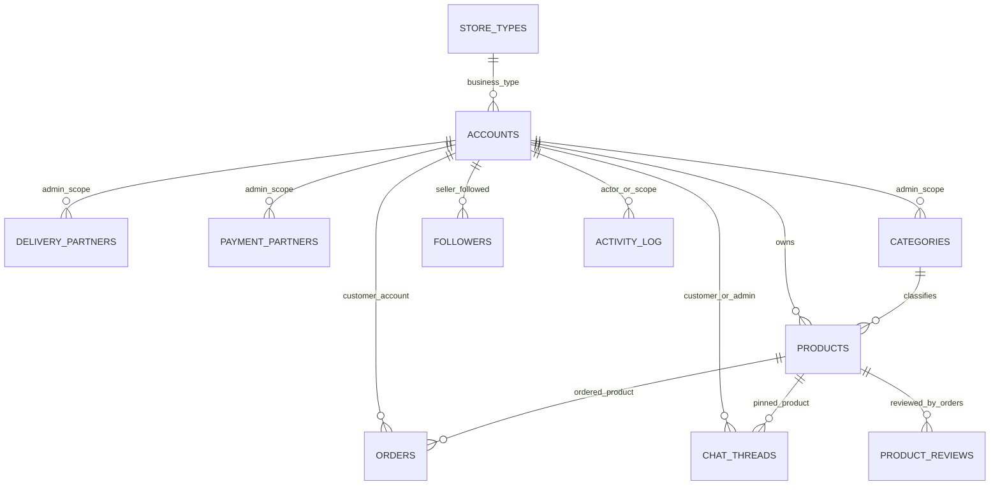

# Database Documentation

## Storage Overview

The project uses local JSON files instead of a SQL or NoSQL database server. Each JSON file acts like a collection. The backend initializes missing files in `backend/server.js` and reads/writes them with `fs/promises`.

Runtime files are stored under `backend/data` and are ignored by Git:

```text
backend/data/accounts.json
backend/data/products.json
backend/data/orders.json
backend/data/categories.json
backend/data/store_types.json
backend/data/chat_threads.json
backend/data/delivery_partners.json
backend/data/payment_partners.json
backend/data/followers.json
backend/data/activity_log.json
```

## ER Diagram



## Common Relationship Fields

| Field | Used In | Meaning |
| --- | --- | --- |
| `adminId` | Accounts, products, orders, categories, partners, chat, activity | Tenant/store/company/workspace owner. |
| `accountId` | Orders, followers, chat/customer flows | Customer account identifier. |
| `productId` | Orders, chat threads, reviews, product actions | Product identifier. |
| `createdAtEpochMs` | Orders | Order group identifier used by pack/ship/cancel endpoints. |
| `threadId` | Chat threads | Chat conversation identifier. |
| `deliveryPartnerIds`, `paymentPartnerIds` | Products | Partner IDs allowed for product checkout. |
| `storeType`, `storeTypeName`, `businessType` | Accounts | Store/business type classification. |

## Constraints and Indexes

- There are no physical indexes because persistence is file based.
- Uniqueness is enforced in code for several fields, including admin email, phone number, employee ID, account email, and product barcode within an admin scope.
- `adminId` is the primary scoping field for multi-tenant reads and writes.
- Many relationships are soft references. Deleting records may leave historical references in orders, activity logs, or chat unless code explicitly cleans them.
- JSON write operations rewrite whole files and are not transactional.

## Collections

### `accounts.json`

Stores admin companies, employees, and customer app users in one collection.

| Field | Type | Notes |
| --- | --- | --- |
| `id` | string | Primary identifier. |
| `adminId` | string | Workspace/company scope. For admin accounts, often equals the admin/company ID. |
| `accountCode` | string | Account or employee code. |
| `role` | string | Examples include admin, employee, and user. |
| `source` | string | Source such as app or web. |
| `storeName`, `companyName`, `businessName` | string | Company/store display names. |
| `storeType`, `storeTypeName`, `businessType` | string | Business type classification. |
| `firstName`, `middleName`, `lastName`, `suffix` | string | Person name fields. |
| `email` | string | Login/contact email. |
| `countryCode`, `mobileNumber` | string | Contact number fields. |
| `password` | string | Current code stores passwords directly. This should be hashed before production. |
| `profileImageUrl` | string | Uploaded profile/logo image. |
| `accessPermissions` | array | Employee/admin module permissions. |
| `accessPermissionGrantedAt` | object | Permission grant timestamps keyed by permission ID. |
| `accessPermissionsConfigured` | boolean | Whether permissions were explicitly configured. |
| `createdAt`, `updatedAt`, `passwordUpdatedAt` | string | ISO timestamps. |
| `isOnline`, `onlineStatus`, `presenceStatus`, `presenceUpdatedAt` | boolean/string | Admin/employee presence. |
| `lastLoginAt`, `lastLogoutAt` | string | Login tracking. |
| `employeeId`, `position`, `timeIn`, `timeOut`, `workHours` | string/number | Employee metadata. |
| `address` | string | User/employee address. |
| `eDocument` | object | Uploaded employee document metadata. |
| `faceVerified`, `verifiedAt` | boolean/string/null | Face verification metadata. |

Nested `eDocument` fields: `type`, `label`, `fileName`, `fileExtension`, `url`, `uploadedAt`.

Primary key: `id`.

Foreign keys/soft references: `adminId` references an admin account/workspace. Store type fields reference `store_types.json` by name.

### `products.json`

Stores catalog products submitted by admins.

| Field | Type | Notes |
| --- | --- | --- |
| `id` | string | Primary identifier. |
| `adminId` | string | Owner workspace. |
| `approvalStatus` | string | Pending/approved state for super admin review. |
| `submittedAt`, `approvedAt`, `approvedBy`, `approvalUpdatedAt` | string | Approval workflow metadata. |
| `name`, `description` | string | Product content. |
| `isActive` | boolean | Visibility/availability toggle. |
| `originalPrice`, `salesPrice` | number | Pricing. |
| `category`, `categories` | string/array | Primary and multi-category values. |
| `imageUrl`, `mainImageUrl`, `imageUrls`, `cardImageUrl` | string/array | Product image references. |
| `videoUrl`, `videoUrls`, `videoThumbnailUrl`, `videoThumbnailUrls` | string/array | Product video references. |
| `model3dUrl`, `model3dScanImageUrls` | string/array | 3D model and source scan assets. |
| `visualSearchImageUrl`, `visualSearchImageUrls`, `visualSearchImageAngles` | string/array/object | Visual search source images. |
| `visualSearchFingerprint`, `visualSearchFingerprints` | object/array | Generated visual-search fingerprints. |
| `stock`, `sold` | number | Inventory and sales counters. |
| `rating`, `ratingCount`, `ratingPoints`, `reviewCount`, `commentCount` | number | Aggregated review/rating values. |
| `variants` | array | Product variant records. |
| `stockHistory` | array | Inventory changes. |
| `barcode` | string | Barcode, unique within admin scope in product save code. |
| `deliveryPartnerIds`, `paymentPartnerIds` | array | Allowed partner references. |
| `reviewComments`, `productReviewComments`, `reviews` | array | Review/comment data or legacy fields. |
| `ratingBreakdown`, `productRatingBreakdown` | object | Counts for ratings 1 through 5. |
| `createdAt`, `updatedAt` | string | ISO timestamps. |

Product variant fields from the Flutter model: `id`, `name`, `quantity`, `imageUrl`, `originalPrice`, `salesPrice`, `stock`, `addOns`.

Stock history fields: `id`, `stock`, `addedQuantity`, `deductedQuantity`, `expiryDate`, `modifiedAt`, `reason`, `label`.

Primary key: `id`.

Foreign keys/soft references: `adminId` -> accounts, partner IDs -> partner collections, categories by name.

### `orders.json`

Stores customer order entries. Multiple entries may share `createdAtEpochMs` as an order group.

| Field | Type | Notes |
| --- | --- | --- |
| `id` | string | Order line identifier. |
| `adminId` | string | Store/workspace owner. |
| `accountId` | string | Customer account. |
| `productId`, `productName`, `productImageUrl` | string | Purchased product snapshot. |
| `variantId`, `variantName`, `addOns` | string/array | Variant/add-on snapshot. |
| `quantity`, `unitPrice` | number | Line item quantity/pricing. |
| `stage` | string | Order stage such as toPay, toPrepare, toShip, toReceive, completed, or cancelled. |
| `createdAtEpochMs`, `createdAt` | number/string | Group timestamp and timestamp text. |
| `grandTotalAmount`, `amountToPayAmount`, `remainingBalanceAmount`, `shippingFeeAmount` | number | Payment amount breakdown. |
| `paymentOptionLabel`, `paymentPartnerName`, `paymentPartnerImageUrl` | string | Payment selection snapshot. |
| `deliveryPartnerName`, `deliveryPartnerImageUrl` | string | Delivery selection snapshot. |
| `clientName`, `clientContactNumber`, `clientAddress` | string | Delivery/contact details. |
| `cancelRequestStatus`, `cancelRequestReason`, `cancelRequestSubmittedAtEpochMs`, `cancelRequestResolvedAtEpochMs` | string/number | Cancellation workflow. |
| `inventoryDeducted`, `inventoryDeductedAtEpochMs`, `inventoryRestoredAtEpochMs` | boolean/number | Inventory movement status. |
| `inventoryMovements` | array | Deduct/restore line details. |
| `productRating`, `productReviewRating`, `productRatedAtEpochMs` | number | Review rating details. |
| `productReviewComment`, `productReviewMedia` | string/array | Review content and uploaded media. |
| `productReviewReply*` | string/number | Seller reply snapshot. |
| `status`, `amount`, `total`, `price`, `courier`, `deliveryProvider`, `payment`, `paymentMethod` | string/number | Legacy or compatibility fields. |

Inventory movement fields: `orderEntryId`, `productId`, `productName`, `variantId`, `variantName`, `quantity`, `role`, `parentProductId`, `parentVariantId`, `adjustedVariant`.

Review media fields: `id`, `type`, `url`, `mediaUrl`, `imageUrl`, `videoUrl`, `fileName`, `contentType`, `sizeBytes`, `uploadedAtEpochMs`, `uploadedAt`.

Primary key: `id`.

Foreign keys/soft references: `accountId` -> accounts, `productId` -> products, `adminId` -> admin workspace.

### `categories.json`

Stores category names.

| Field | Type | Notes |
| --- | --- | --- |
| `name` | string | Category display name. |
| `adminId` | string | Workspace scope. Global categories use the default admin scope. |

Primary key: no explicit ID; `name` plus `adminId` is the logical key.

Foreign keys/soft references: Products reference categories by name.

### `store_types.json`

Stores global Store Type/Business Type definitions managed by super admin.

| Field | Type | Notes |
| --- | --- | --- |
| `name` | string | Logical primary key and display name. |
| `categories` | array | Categories associated with this business type. |
| `status` | string | Active/inactive style status. Public `/api/store-types` only returns active store types. |
| `commissionRate` | number | Commission percentage or rate value used for dashboard visibility. |
| `serviceFee` | number | Service fee value used for dashboard visibility. |

Primary key: `name`.

Foreign keys/soft references: Accounts reference store types by `storeType`, `storeTypeName`, or `businessType`.

### `chat_threads.json`

Stores customer support conversations.

| Field | Type | Notes |
| --- | --- | --- |
| `threadId` | string | Primary identifier. |
| `adminId` | string | Store/workspace owner. |
| `customerId`, `userId` | string | Customer account identifier. |
| `customerLabel` | string | Customer display label. |
| `productId`, `productName`, `productCategory`, `productDescription`, `productImageUrl` | string | Product context. |
| `productOriginalPrice`, `productSalesPrice`, `productStock`, `productSold`, `productRating` | number | Product snapshot. |
| `productShowsTopBrand` | boolean | Product badge/context flag. |
| `companyName`, `companyPictureUrl` | string | Seller/company context. |
| `employeeRating`, `employeeRatingComment`, `employeeRatingUpdatedAt` | number/string/null | Customer rating of employee/support. |
| `updatedAt`, `lastReadAt`, `supportReadAt` | string | Read/update timestamps. |
| `typing` | object | User/employee typing and online state. |
| `messages` | array | Chat messages. |

Message fields: `id`, `text`, `imageUrl`, `imageName`, `isFromSupport`, `isSentToServer`, `timestamp`, `source`, `editedAt`, `deletedAt`, `replyTo`.

Primary key: `threadId`.

Foreign keys/soft references: `adminId` -> admin workspace, `customerId`/`userId` -> accounts, `productId` -> products.

### `delivery_partners.json`

Stores delivery partner records.

| Field | Type | Notes |
| --- | --- | --- |
| `id` | string | Primary identifier. |
| `branch` | string | Partner/branch name. |
| `description` | string | Description. |
| `imageUrl` | string | Logo or image. |
| `adminId` | string | Workspace scope when not global. |
| `isActive`, `enabled`, `isEnabled`, `disabled` | boolean | Compatibility active-state fields. |
| `status` | string | Active/inactive state. |
| `createdAt`, `updatedAt` | string | Timestamps. |

Primary key: `id`.

Foreign keys/soft references: Products reference delivery partners through `deliveryPartnerIds`.

### `payment_partners.json`

Stores payment partner records.

| Field | Type | Notes |
| --- | --- | --- |
| `id` | string | Primary identifier. |
| `branch` | string | Partner/branch name. |
| `imageUrl` | string | Logo or image. |
| `adminId` | string | Workspace scope when not global. |
| `isActive`, `enabled`, `isEnabled`, `disabled` | boolean | Compatibility active-state fields. |
| `status` | string | Active/inactive state. |
| `createdAt`, `updatedAt` | string | Timestamps. |

Primary key: `id`.

Foreign keys/soft references: Products reference payment partners through `paymentPartnerIds`.

### `followers.json`

Stores seller followers as an object map.

| Key/Value | Type | Notes |
| --- | --- | --- |
| `{adminId}` | array | Each key is a seller/admin ID. The array contains follower account IDs. |

Logical key: seller `adminId`.

Foreign keys/soft references: Map keys reference seller/admin accounts. Array values reference customer accounts.

### `activity_log.json`

Stores recent operational and notification events.

| Field | Type | Notes |
| --- | --- | --- |
| `id` | string | Event identifier. |
| `type` | string | Event type. |
| `targetPermission` | string | Admin permission/module audience. |
| `adminId` | string | Workspace scope. |
| `action` | string | Action such as created, updated, deleted. |
| `productId`, `productName`, `category` | string | Product-related context. |
| `actor` | object | Person/system actor metadata. |
| `title`, `description` | string | Notification text. |
| `changeCount`, `changeType`, `changeLabel`, `changeTarget`, `changeVariantId`, `changeVariantName` | number/string | Inventory/change details. |
| `targetUrl` | string | Optional UI deep link. |
| `notificationAudience` | string | Audience filtering. |
| `createdAt` | string | Timestamp. |

Primary key: `id`.

Constraint: backend trims activity log to `MAX_ACTIVITY_ENTRIES` of 50 entries.

