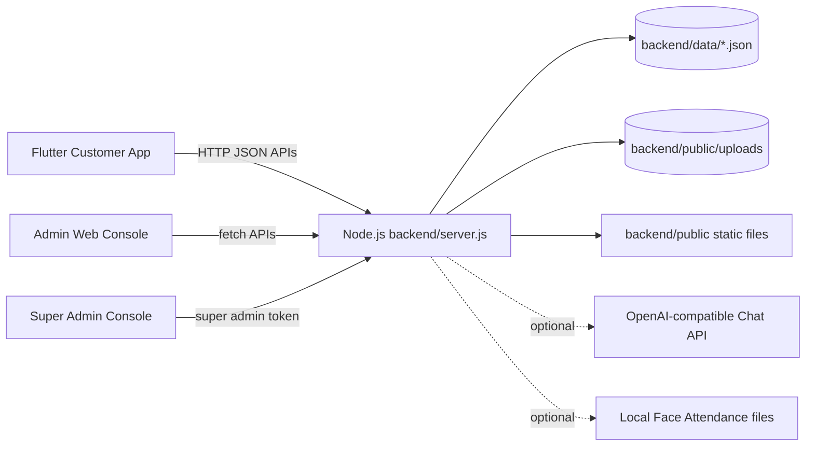
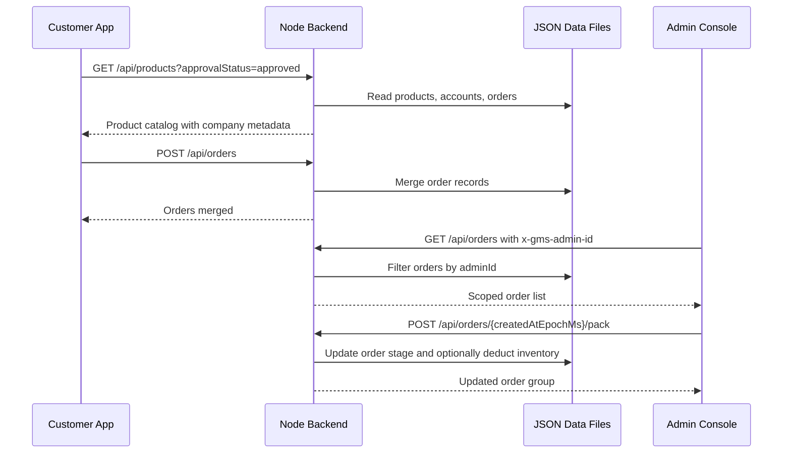
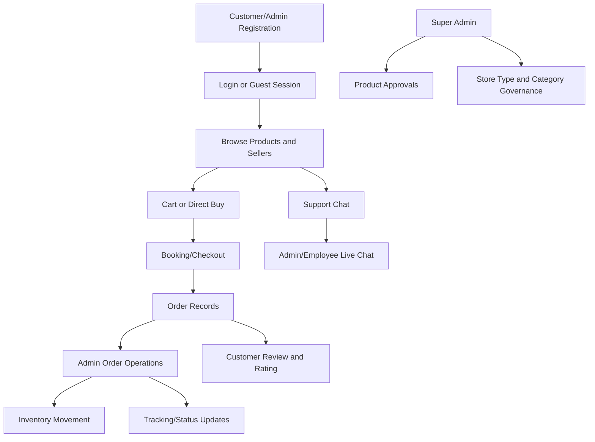

# System Architecture

## Overall Architecture

Switch uses a client-server architecture:

- The **Flutter app** provides the customer shopping experience across mobile, desktop, and web.
- The **admin console** is a static web application served from the Node backend.
- The **Node.js backend** exposes JSON APIs, serves static assets, processes uploads, performs image/visual-search processing, and persists data into local JSON files.
- The **data layer** is file based. JSON files under `backend/data` act as collections for products, accounts, orders, chat threads, categories, store types, partners, followers, and activity logs.



## Frontend

### Flutter App

The Flutter app is under `lib/`. It includes:

- `main.dart` as the app entry point and tab/navigation shell.
- Product listing, product details, seller pages, cart, checkout, order tracking, reviews, profile, and chat pages.
- Service abstractions in `lib/services/` with web, IO, and stub implementations.
- Local persistence through `shared_preferences` for account sessions, cart, favorites, orders, chat cache, guest mode, and profile fragments.

### Admin Web Console

The browser admin console is under `backend/public/`. It is composed of static HTML pages with page-specific JavaScript and shared CSS/theme/navigation scripts. It includes pages for:

- Login and registration
- Store overview dashboard
- Product listing and product editor
- Inventory and stock management
- Packing and tracking
- Concerns/cancel requests
- Live chat
- Employee data and access control
- Insights/reports
- Delivery and payment partner management
- Super admin dashboard and product approvals

## Backend

`backend/server.js` is a single Node.js HTTP server. It handles:

- Static file serving from `backend/public`
- CORS and JSON response formatting
- JSON body and binary upload parsing
- Admin, employee, customer, and super admin login
- Tenant/workspace scoping through `adminId`
- Products, orders, accounts, categories, store types, partners, followers, chat, activity, uploads, and model generation APIs
- JSON data initialization and migration helpers
- Optional AI chat reply calls
- Optional face attendance profile reads/cleanup

## Database

The system currently uses local JSON files:

```text
backend/data/accounts.json
backend/data/products.json
backend/data/orders.json
backend/data/categories.json
backend/data/store_types.json
backend/data/chat_threads.json
backend/data/delivery_partners.json
backend/data/payment_partners.json
backend/data/followers.json
backend/data/activity_log.json
```

Each file is read and rewritten by the backend. There are no SQL indexes, migrations, or transaction guarantees. Relationships are maintained through identifiers such as `adminId`, `accountId`, `productId`, `createdAtEpochMs`, `threadId`, and partner IDs.

## APIs

The backend exposes REST-like JSON endpoints for:

- Authentication and sessions
- Products and product approvals
- Visual product search
- Accounts, admins, employees, and users
- Orders and order state transitions
- Chat support and AI replies
- Product reviews and replies
- Sellers and followers
- Categories and store types
- Delivery and payment partners
- Activity notifications
- Uploads and generated 3D product models

See `API_DOCUMENTATION.md` for endpoint details.

## Authentication and Authorization

Authentication is currently implemented with:

- Customer login through `/api/accounts/login`
- Admin login through `/api/admin-login`
- Employee login through `/api/employee-login`
- Super admin login through `/api/super-admin-login`
- Browser-side session/local storage keys such as `gms-admin-session`, `gms-employee-session`, `gms-super-admin-session`, and `gms-admin-id`
- Backend super admin authorization through `x-gms-super-admin-token`
- Workspace scoping through `x-gms-admin-id`, `x-admin-id`, or query parameters such as `adminId`, `tenantId`, and `workspaceId`

No JWT library, signed cookie session, password hashing, CSRF middleware, or role-based middleware framework was found.

## File Storage

Uploaded files are stored under `backend/public/uploads` and served as public static assets. The backend supports:

- Image/video/model uploads through `/api/uploads`
- Review media uploads through `/api/review-uploads`
- Employee document uploads through `/api/document-uploads`
- Generated 3D model files from frame/scan endpoints

Images are converted to WebP when `sharp` is available and when the upload should not preserve PNG.

## Third-Party Integrations

- `sharp` is used server-side for image conversion and visual-search fingerprinting.
- `CHAT_AI_API_URL`, `CHAT_AI_API_KEY` or `OPENAI_API_KEY`, and model variables enable optional OpenAI-compatible chat replies.
- Flutter uses Google ML Kit object detection packages for visual search preparation on supported platforms.
- Face Attendance data can be read from external local files configured by environment variables.
- Payment and delivery partners are internal records, not direct live gateway/courier integrations in the current code.

## Data Flow



## System Flow



## Deployment Shape

For development, the backend runs locally on port `8080` by default. Flutter services use `API_BASE_URL` when supplied, otherwise fall back to local URLs such as `http://127.0.0.1:8080`, `http://localhost:8080`, and `http://10.0.2.2:8080` for Android emulator.

